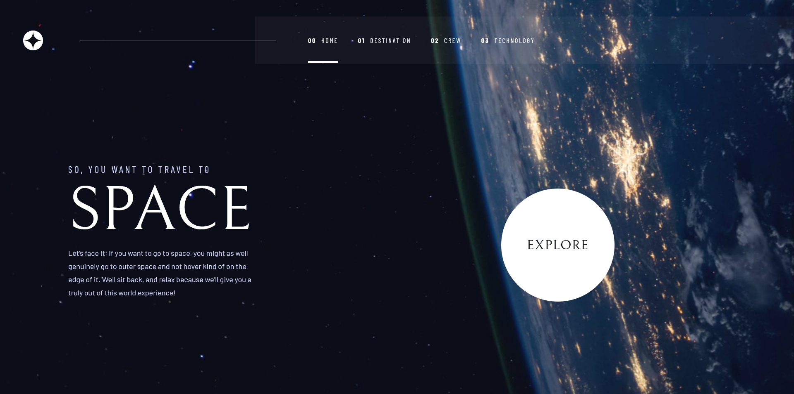

# Space tourism website solution 🔮 || Frontend Mentor

This is a solution to the [Space tourism website challenge on Frontend Mentor](https://www.frontendmentor.io/challenges/space-tourism-multipage-website-gRWj1URZ3). Frontend Mentor challenges help you improve your coding skills by building realistic projects.

## Table of contents

- [Overview](#overview)
  - [The challenge](#the-challenge)
  - [Screenshot](#screenshot)
  - [Links](#links)
- [My process](#my-process)
  - [Built with](#built-with)
  - [What I learned](#what-i-learned)
  - [Continued development](#continued-development)
  - [Useful resources](#useful-resources)
- [Author](#author)

## Overview

### The challenge

Users should be able to:

- View the optimal layout for each of the website's pages depending on their device's screen size
- See hover states for all interactive elements on the page
- View each page and be able to toggle between the tabs to see new information

### Screenshot

### Links

- Solution URL: [Here](https://www.frontendmentor.io/solutions/responsive-space-tourism-website-using-react-tailwindcss-HyzffI9Qq)
- Live Site URL: [Here](https://spacae-tourism-website-ah8rp65jl-mohanadoo.vercel.app/)

## My process

### Built with

- Semantic HTML5 markup
- Flexbox
- [React](https://reactjs.org/) - JS library
- [Tailwind CSS](https://tailwindcss.com/) - CSS Framework

### What I learned

Here are the things I have learned working on this project:

- **React Router DOM**
- **Framer Motion**

In React Router DOM I learned how to create multiple page website and any additional routes inside each page.

And in Framer Motion I learned how to add Animations for Page transitions or when component re-render and Animations for any element in the page.

### Continued development

I want to Learn more about Framer Motion in React because I liked how simple it is to use and also can be very useful to create complex animation if used very well I want to start bt watching [this playlist by The Net Ninja](https://www.youtube.com/playlist?list=PL4cUxeGkcC9iHDnQfTHEVVceOEBsOf07i) and maybe diving more into their documentation [Framer Motion Docs](https://www.framer.com/docs/). further more there is a lot of interesting tutorials on Youtube to create amazing filtering animations, smooth transitions and more that I will take in consideration when building my next project.

### Useful resources

- [React Router Tutorial by Dev Ed](https://www.youtube.com/watch?v=Law7wfdg_ls&ab_channel=DevEd) - I started my journey to learn react router from this Youtube Tutorial.
- [React Router V6 Tutorial](https://www.youtube.com/watch?v=UjHT_NKR_gU&list=PLD8l6mht7U0ZKycdFrIf7UpLl6YGhsyIf&index=2&t=1034s&ab_channel=PedroTech) - This tutorial also helped me more on how to use react router for the latest version.
- [Nested Router Tutorial](https://www.youtube.com/watch?v=PWi9V9d_Jsc&list=PLD8l6mht7U0ZKycdFrIf7UpLl6YGhsyIf&index=3&ab_channel=PedroTech) - This helped me to create the different links in each page for example choosing the Titan planet in the Destination page will take you to `./destination/titan` and so on for the other pages.
- [Page Transition in React](https://www.youtube.com/watch?v=FdrEjwymzdY&list=PLD8l6mht7U0bga1BJ6N4HNCMW7d1LDAcC&index=12&ab_channel=PedroTech) - This is a great tutorial simplifying how easy it is to make page transition animations in react using Framer Motion

## Author

- Website - [Mohanad Alrwaihy](https://mohanad-portfolio.pages.dev/)
- Frontend Mentor - [@MohanadOO](https://www.frontendmentor.io/profile/MohanadOO)
